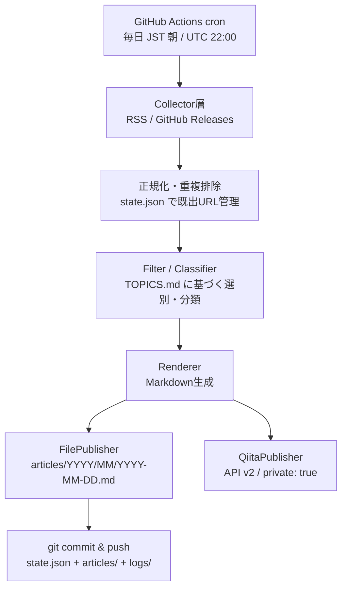

# DESIGN.md — qiita-frontend-digest 設計ドキュメント

## 背景・目的

チーム異動によりフロントエンドの最新情報に触れる機会が減ったため、情報収集を自動化する。フロントエンドの最新ニュースを毎日収集し、Markdown記事として保存・Qiitaに投稿する。OSSとして公開し、他者がCollectorやトピック定義を差し替えて使える構造にする。

## パイプライン全体像



## レイヤー設計

### 1. Collector層(プラグイン)

```typescript
interface NewsItem {
  title: string;
  url: string;
  publishedAt: Date;
  source: string;
  summary?: string;
}

interface Collector {
  name: string;
  fetch(): Promise<NewsItem[]>;
}
```

初期実装は2つ。

- `RssCollector`: config.yaml で指定したフィードURL群(JSer.info、web.dev、各フレームワーク公式ブログ等)
- `GitHubReleasesCollector`: 指定リポジトリ(react、typescript、vite 等)のRelease監視

フォーク利用者が独自Collectorを追加できることがOSSとしての拡張点。

### 2. 正規化・重複排除

- 既出URLのリストを `state.json` としてリポジトリにコミットバック(DB不要、履歴はGitで追跡)
- URL正規化(トラッキングパラメータ除去)を通してから照合する

### 3. Filter / Classifier(TOPICS.md 駆動)

```typescript
interface TopicMatcher {
  classify(item: NewsItem): { topic: string; relevance: "high" | "medium" | "skip" };
}
```

- 「何を拾うか」は `TOPICS.md` に宣言的に記述し、育てていく
- TOPICS.md は自由記述のMarkdownだが、`##` 見出し(トピック名)と `keywords:` 行だけは構造規約として固定
- **LLMなしモード**: `keywords:` 行のキーワードマッチのみで判定(デフォルト)
- **LLMありモード**(オプトイン): TOPICS.md全文をプロンプトに注入し、`note` の自然言語ニュアンスも含めて関連度を判定
- skip判定した記事は `logs/skipped/YYYY-MM-DD.json` に残す(トピック定義の穴を発見する材料)

### 4. Renderer

- 記事セクション構成は TOPICS.md の見出しから動的に生成(トピック追加 = カテゴリ追加)
- 形式: タイトル + リンク + 一言。LLM要約はオプトイン
- TOPICS.md からは「セクション名の一覧」のみを受け取る疎結合を維持

### 5. Publisher(プラグイン)

- `FilePublisher`: `articles/YYYY/MM/YYYY-MM-DD.md` へ書き出し。アーカイブが `git grep` で検索可能になり、投稿失敗時のリトライ元にもなる
- `QiitaPublisher`: Qiita API v2 `POST /api/v2/items`。トークンは `QIITA_TOKEN`(GitHub Secrets)

```typescript
await fetch("https://qiita.com/api/v2/items", {
  method: "POST",
  headers: {
    Authorization: `Bearer ${process.env.QIITA_TOKEN}`,
    "Content-Type": "application/json",
  },
  body: JSON.stringify({
    title: `フロントエンド最新ニュース ${today}`,
    body: markdown,
    tags: [{ name: "frontend" }, { name: "news" }],
    private: true,
  }),
});
```

**運用上の注意**: Qiitaは機械生成記事の大量公開投稿に厳しいため、デフォルトは `private: true`(限定共有)。公開したい記事のみ手動で切り替える。

## ディレクトリ構成

```
qiita-frontend-digest/
├── src/
│   ├── collectors/     # Collector実装 + index.ts(バレル)
│   ├── core/           # dedup、state管理、TopicMatcher
│   ├── render/         # Markdownテンプレート
│   └── publish/        # FilePublisher / QiitaPublisher
├── articles/           # 日付別アーカイブ YYYY/MM/YYYY-MM-DD.md
├── logs/skipped/       # フィルタ落ち記事のログ
├── docs/DESIGN.md      # このファイル
├── TOPICS.md           # 収集トピック定義(育てる)
├── CLAUDE.md           # Claude Code向けガードレール
├── config.yaml.example # フィードURL、タグ、公開設定の雛形
├── state.json          # 既出URL
└── .github/workflows/daily.yml
```

`config.yaml` 本体は .gitignore 対象。

## GitHub Actions

- cron: `0 22 * * *`(UTC 22:00 = JST 翌朝7:00)
- 処理後に `state.json`、`articles/`、`logs/` をコミットバック
- Secrets: `QIITA_TOKEN`(必須)、LLM用APIキー(オプトイン時のみ)

## README 章立て(公開時)

Features / How it works(Mermaid図)/ Setup / Configuration / Adding a collector / Development / Roadmap / License(MIT)

## ロードマップ

- **v0.1**: RSS 1本 → articles/ 保存 → Qiita限定共有投稿(最小の一気通貫)
- **v0.2**: Collector追加(GitHub Releases)、TOPICS.mdによるフィルタ、skippedログ
- **v0.3**: 週次でskippedログをLLMに分析させ、TOPICS.mdへの追記案をPRとして自動作成(自己成長するニュースフィルタ)
